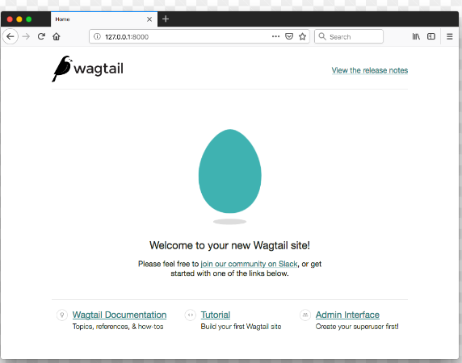

# Install and run Wagtail

## -> Install dependencies
Wagtail supports Python 3.7, 3.8, 3.9, 3.10, and 3.11.
To check whether you have an appropriate version of Python 3:

    python --version

## -> Create and activate a virtual environment
We recommend using a virtual environment, which isolates installed dependencies from other projects. This tutorial uses venv, which is packaged with Python 3.
On Windows (cmd.exe):

    py -m venv mysite\env
    mysite\env\Scripts\activate.bat
    # or:
    mysite\env\Scripts\activate

## -> Install Wagtail
Use pip, which is packaged with Python, to install Wagtail and its dependencies:

    pip install wagtail

## -> Generate your site
Wagtail provides a start command similar to django-admin startproject. Running wagtail start mysite in your project will generate a new mysite folder with a few Wagtail-specific extras, including the required project settings, a “home” app with a blank HomePage model and basic templates, and a sample “search” app.

Because the folder mysite was already created by venv, run wagtail start with an additional argument to specify the destination directory:

    wagtail start mysite mysite

## -> Install project dependencies
    cd mysite
    pip install -r requirements.txt
This ensures that you have the relevant versions of Wagtail, Django, and any other dependencies for the project you have just created. The requirements.txt file contains all the dependencies needed in order to run the project.

## -> Create the database
    python manage.py makemigrations
    python manage.py migrate
This command ensures that the tables in your database are matched to the models in your project. 

Every time you alter your model (for example you may add a field to a model) you will need to run this command in order to update the database.

## -> Create an admin user
    python manage.py createsuperuser
When logged into the admin site, a superuser has full permissions and is able to view/create/manage the database.

## -> Start the server
    python manage.py runserver
If everything worked, http://127.0.0.1:8000 will show you a welcome page:

   